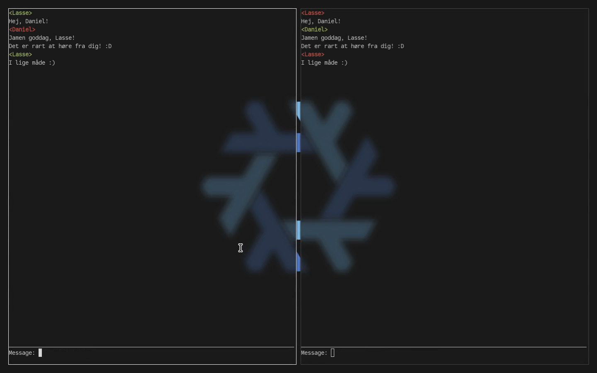
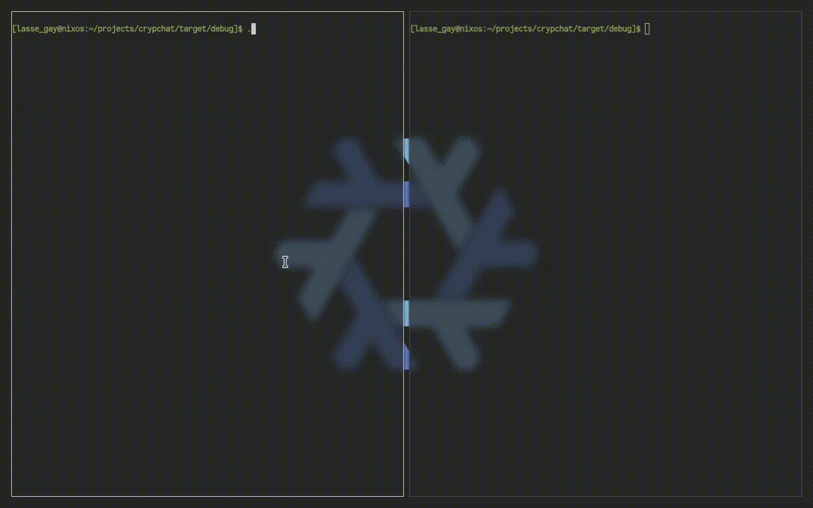

    

# Crypchat
Crypchat is a terminal-based E2EE P2P chat application. The purpose of this project is to show resistance towards the EU Chat Control initiative while also displaying proficiency in system development and cryptology.

    

## Demo

    

## Engineering
This app uses [`crossterm`](https://crates.io/crates/crossterm) to manipulate the terminal, [`iroh`](https://crates.io/crates/iroh) to establish a peer-to-peer connection and [`aes`](https://crates.io/crates/aes) for the end-to-end encryption. A shared-secret-key is created via my custom elliptic curve Diffie-Hellman implementation, and messages are encrypted using AES-CBC mode.
