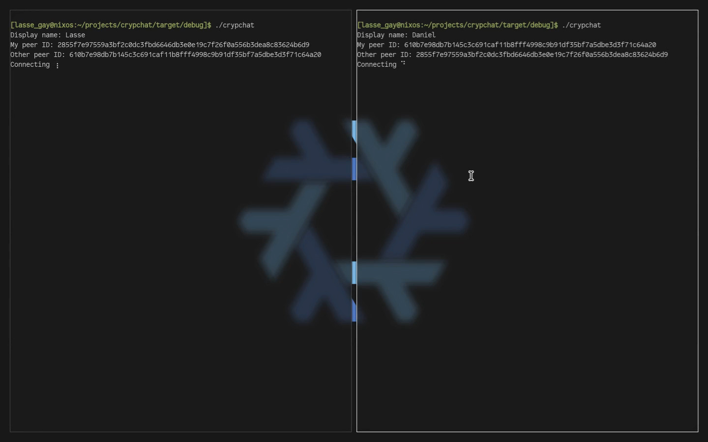

    

# Crypchat
Crypchat is a terminal-based E2EE P2P chat application. The purpose of this project is to show resistance towards the EU Chat Control initiative while also displaying proficiency in system development and cryptology.

    
    ➡️
    

